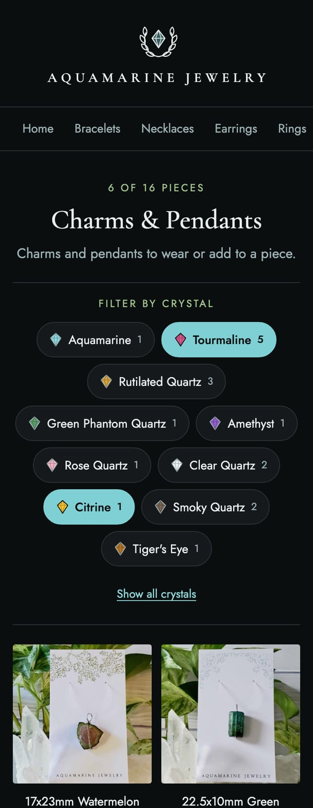
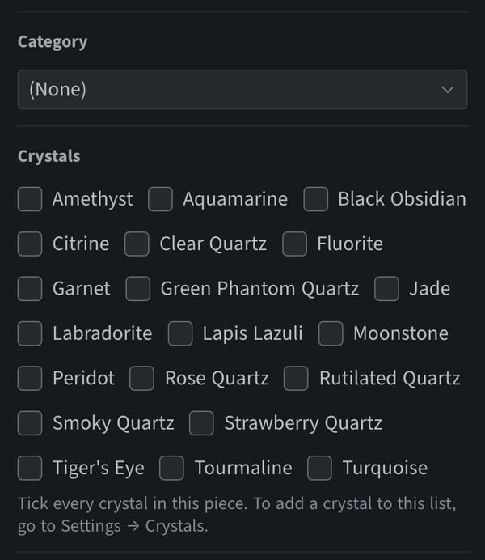
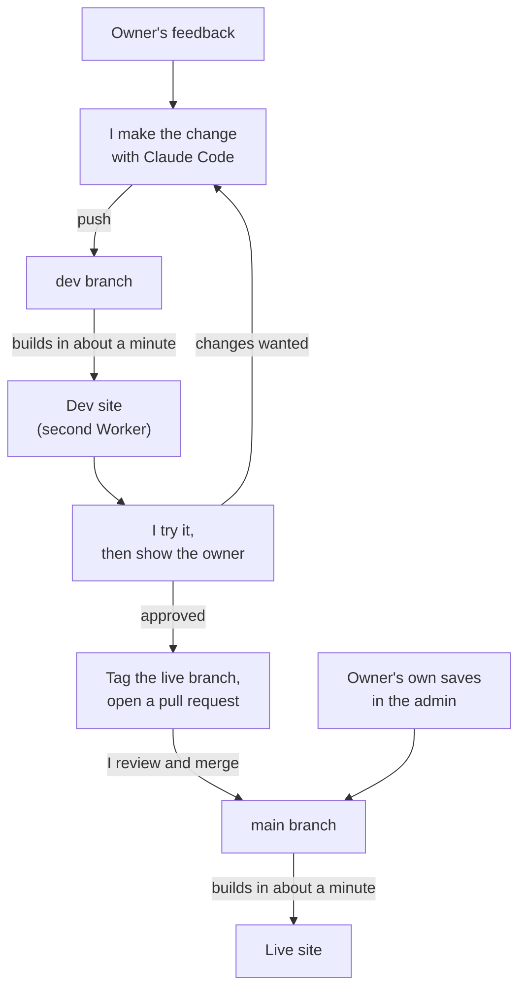

# After launch: from feedback to live in hours

The first release was not the end of the project. The owner started using the site and came back with requests. Three changes were live a day and a half after the first release, each through a pull request, and from the second one on, each tried on a separate copy of the site before it reached the real one.

This page shows the three changes, and the pipeline that made them quick and safe.

## The three changes

| What the owner said | What changed |
|---|---|
| Adding photos one at a time is slow. | The Photos field takes several photos in one go. |
| Customers choose by crystal first, then by type of piece. | Each piece can be tagged with its crystals, and category pages have a crystal filter. |
| Putting photos in order on a phone is hard. | On a phone the photos show as a grid, three across, with arrows to move them. |

### 1. Several photos at once

The admin asked for photos one by one, each with a written description. For a shop that photographs every piece five or six times, that was the slowest part of adding a product.

The Photos field now accepts a whole selection in one go, and the description field is gone; the site uses the name of the piece instead. Existing pieces kept working, because the site reads both the old and the new format.

### 2. Crystals, and a filter by crystal

The owner's customers think in stones: aquamarine, tourmaline, rutilated quartz. The site only grouped pieces by type, such as bracelets or pendants.

I showed a prototype before building anything, and the feedback changed the design twice:

1. The first prototype put crystals on the home page, in three layouts to choose from.
2. The feedback was to leave the home page as it was and filter by crystal *inside* a category. The second prototype did that: one on/off button per crystal, above the pieces.
3. The last round added a small stone next to each name, the same shape for every crystal, in that crystal's colour.

| The filter on a category page (prototype) | Tagging a piece in the admin |
|---|---|
|  |  |

What was built:

- **A list of crystals the owner controls.** It starts with twenty common ones, each with a colour, and can be edited in the admin like the categories.
- **Tick boxes on each piece.** A piece can have more than one crystal.
- **A filter that only offers what is there.** A category page shows a button for each crystal found among its own pieces, with a count. With nothing switched on, every piece shows.
- **A link that remembers the choice.** The crystals that are switched on are kept in the page address, so a filtered page can be shared.
- **No server.** The filtering happens in the visitor's browser; the site is still a folder of plain files.

### 3. Photos as a grid on a phone

Once several photos could be added at once, the next problem showed up: they arrive in the order the phone's photo picker hands them over, not the order they were tapped in, and the first photo is the one used as the cover.

The owner asked for the photos to follow the selection order. That turned out to be something a web page cannot do. The browser passes on a finished list and does not say which photo was tapped first. The editor's own drag-and-drop does not help on a phone either: it needs a mouse.

So the answer was to make reordering easy instead. On a touch screen the photos now show as a grid, three across, each with its position number, two arrows to move it earlier or later, and a button to remove it.

| Before: one photo per row | After: a grid, three across |
|---|---|
|  |  |

The same six photos take about half the height. The change is a stylesheet laid over the editor's own list, so adding, moving, removing and saving still run the editor's code. With a mouse nothing changes, because the editor's drag handle only works in a one-column list.

## The pipeline that made this quick

A change to a live shop needs somewhere to be wrong first. For these changes I added a second copy of the site.

- **Two branches, two sites.** The `main` branch is the live site. A `dev` branch is built by a second Cloudflare Worker to its own address. Both builds are automatic and take about a minute.
- **The dev site has a working admin.** The admin page looks at the address it was opened from: on the dev site it reads and saves the `dev` branch, on the live site the `main` branch. I can add a test product with real photos on my phone and nothing reaches the shop.
- **I try it first, then the owner sees it.** I use the dev site on a phone, show the owner, and take the feedback back into the change. That loop is the left side of the diagram, and it can go round several times in an evening.
- **A pull request is the only door to the live site.** When the owner is happy, I open a pull request from `dev` to `main`, read what it contains, and merge it. The live site rebuilds itself.
- **The owner's own work is never blocked.** Saving a piece in the live admin still commits straight to `main` and goes live in a minute, whatever I am working on.

## The rules that keep it safe

| Rule | Why |
|---|---|
| Bring `dev` up to date with `main` before starting. | The owner saves to `main` at any time, so it is often ahead. |
| Try a change on my own machine before committing it. | The dev site is public. It is for showing finished work on a real phone, not for experiments. |
| A pull request never contains a product. | Products belong to the owner and reach the live site only through the owner's own saves. One command lists any difference, and it must print nothing. |
| Tag `main` before opening a pull request. | A named point to go back to if a change turns out wrong. |
| Check every deploy twice. | First the build result that Cloudflare reports on the commit, then the live pages themselves. |

## How long it took

The times are from the Git history, in Pacific time.

| When | What |
|---|---|
| Oct 1, 00:28 | First release tagged |
| Oct 1, 16:47 | Several photos at once: merged and live |
| Oct 1, evening | Second Worker added, so the `dev` branch has its own site |
| Oct 2, 00:18 | Crystals and the filter: merged and live |
| Oct 2, 12:05 | Photo grid: committed to `dev` and on the dev site |
| Oct 2, 12:38 | Photo grid: merged and live |

Three changes in a day and a half. For the last one, the dev site build, a test product in the dev admin, the pull request and the merge all fitted into those last 33 minutes.

In the same period the owner made 17 saves in the live admin, including removing the sample pieces and adding the first real one. None of them waited for me.

## What went wrong, and how it was caught

| What happened | How it was caught |
|---|---|
| The first crystal prototype answered the wrong question: it redesigned the home page, when what was wanted was a filter inside each category. | By showing a prototype before building. Changing direction cost one more prototype, not a rebuilt feature. |
| A test I saved on the dev site's admin was included in a pull request to the live branch. | I saw a product file in the pull request while reviewing it. It was removed, and "a pull request never contains a product" became a written rule with a check. |
| The dev site's admin was reading and saving the live branch. | The new crystal list came up empty there, because the list only existed on `dev`. The admin now picks its branch from the address it is opened on. |
| The owner asked for photos to follow the order they were selected in, which the browser cannot provide. | Claude Code read the editor's source before proposing anything, found the limit, and said so. We changed the goal to making reordering easy. |
| Each Worker also tries to build the other one's branch as a preview and fails, which marks the commit with a red cross although the real deploy succeeded. | By reading both build results for every commit. It is a setting to turn off, not a fault in the site. |

## What I took from it

- **A dev site turns "I think this works" into "look at it on your phone".** The owner does not read pull requests. A second address that can be opened and tapped is the review tool that fits.
- **Automation is what made small requests cheap.** Push, build, look, merge, build. No step waits for someone to copy files or restart anything, so a one-hour change takes one hour.
- **Guard the owner's content, not just the code.** The rule I value most is the one about products: my changes and the owner's saves travel on separate tracks, and only the owner's track carries products.

---

The source code and the shop's content are kept in a private repository. Back to the [README](README.md).
