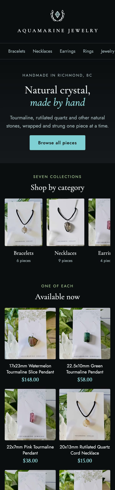
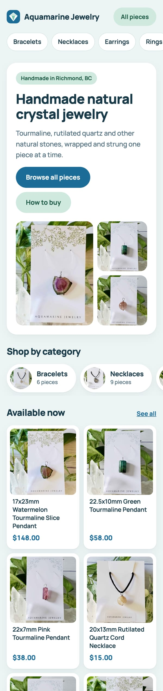
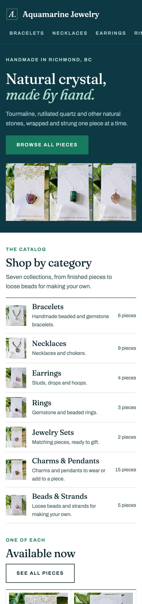
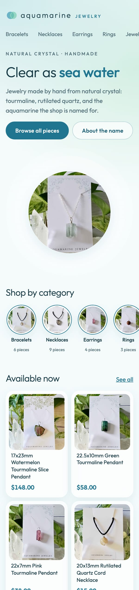
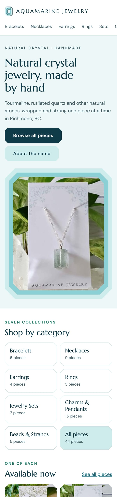
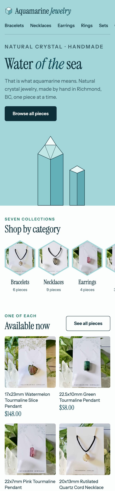
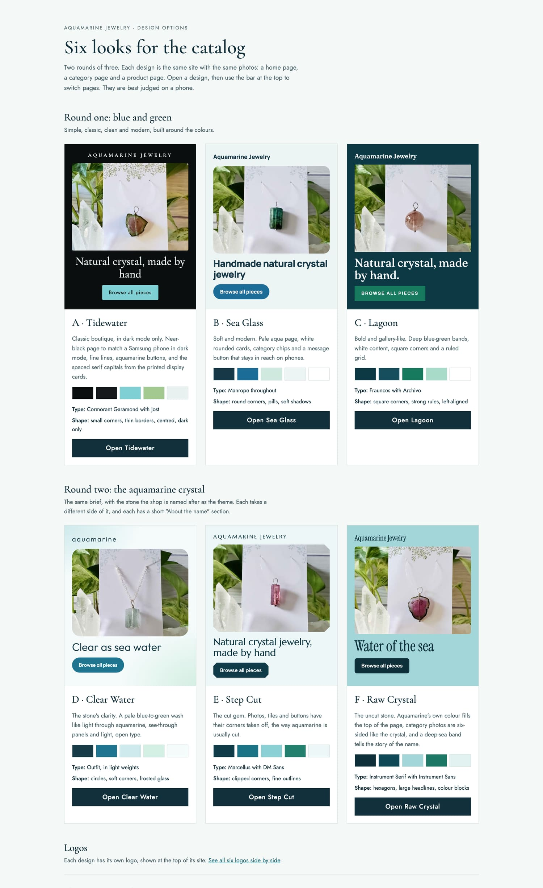
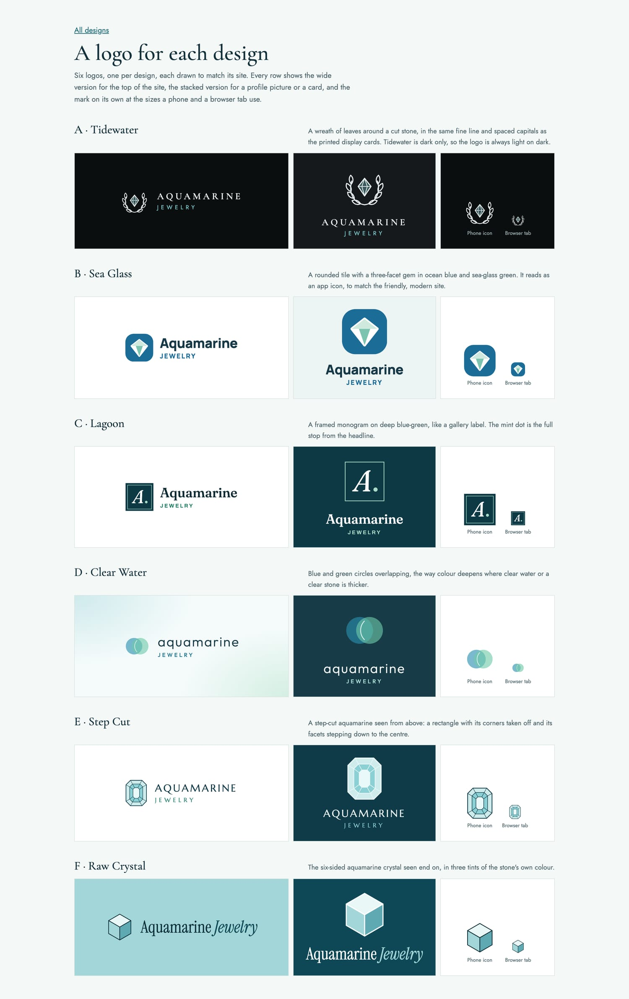
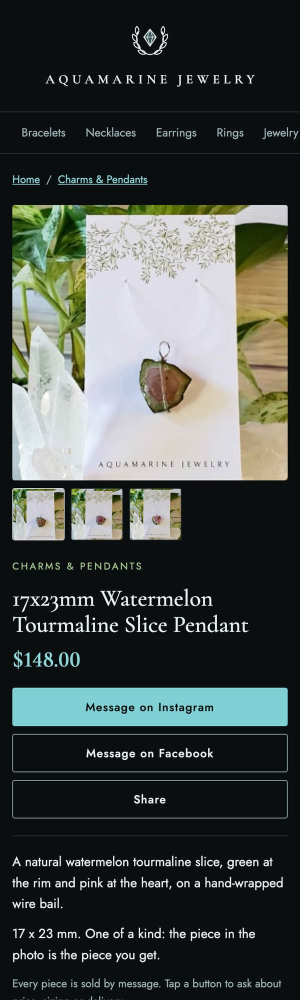

# Six designs for the owner to choose from

Before the site was handed over, I asked Claude Code for design options the owner could pick from on a phone. It produced six working prototypes and a logo for each. This page shows all of them and why each looks the way it does.

Left to right: Tidewater, Sea Glass, Lagoon, Clear Water, Step Cut, Raw Crystal.

## The brief

The owner's brief, as I passed it on:

> Natural crystal, handmade. Simple, classic, clean and modern. Blue and green.

As reference, I supplied three screenshots of the shop's Facebook Marketplace listings. Claude Code drew two conclusions from them before designing:

- **The shop already has a visual identity.** Every piece hangs on a white card printed with the shop's name in small, widely spaced serif capitals, under fine botanical line art.
- **The photos are busy and very green.** Each one has the white card in the middle with leaves and clear quartz around it. So the page should stay quiet and let blue carry the text and accents.

Each prototype is a static page with three screens (home, category and product) and uses the shop's own photos, cropped from those screenshots. Product titles and descriptions in the prototypes are placeholder text.

## Round one: blue and green

Three takes on the brief that differ in layout and type, not only in colour.

| A · Tidewater | B · Sea Glass | C · Lagoon |
|---|---|---|
|  |  |  |
| **Classic boutique.** A centred layout, serif headings, hairline rules, and a wordmark in the spaced capitals from the shop's printed cards. Shown here in the dark version the owner chose. | **Soft and modern.** A pale aqua page, white rounded cards, category chips, a "How to buy" strip, and a message button fixed within reach of the thumb on product pages. | **Bold and gallery-like.** Deep blue-green bands at the top and bottom, square corners, a ruled category list and a ruled product grid. |

## Round two: the aquamarine crystal

After the first three, I gave Claude Code one more fact: the shop is named Aquamarine because that crystal is good for the owner. The second round uses the stone itself as the theme. Each design takes a different side of it, and each has a short "About the name" section.

| D · Clear Water | E · Step Cut | F · Raw Crystal |
|---|---|---|
|  |  |  |
| **The stone's clarity.** A pale blue-to-green wash like light through the stone, translucent panels, light open type and round category photos. | **The cut gem.** Aquamarine is usually given a step cut: a rectangle with its corners taken off. Photos, category tiles and buttons all carry that clipped corner. | **The uncut stone.** Aquamarine's own colour fills the top of the page, category photos are six-sided like the crystal, and a deep band explains the name. |

## The comparison sheet

The prototypes came with an overview page the owner could open on a phone: each design's colours, typefaces and shapes, with a button to open it.

## A logo for each design

Each design got its own logo, shown wide, stacked, and at phone-icon and browser-tab size.

Two of the logos came with a note from Claude Code about their limits, which I kept because it was right: the wreath in the Tidewater logo blurs at browser-tab size, and the Raw Crystal mark reads as a cube more than a crystal. The finished site uses the stone alone as its tab icon for that reason.

## The choice

The owner chose **A · Tidewater**, then asked for one change: dark mode only, to match a phone that is always in dark mode.

| First shown | As chosen | A product page |
|---|---|---|
|  |  |  |

The dark version keeps the layout and type and changes the palette: a near-black page, soft white text, and aquamarine for buttons, prices and links. The shop's white-card photos become the brightest thing on the page, like the cards under a light.

## Checked on a phone, by measurement

The prototypes were first checked by looking at screenshots. When I asked whether they were good at phone size, Claude Code measured every screen at 320, 360 and 390 pixels wide. That found a real fault the screenshots had hidden: Sea Glass scrolled sideways on every screen. It was fixed, along with small tap targets and text under 12 pixels in all six.

---

The source code and the shop's content are kept in a private repository. The product photos are the owner's own and are shown with permission. Back to the [README](README.md).
