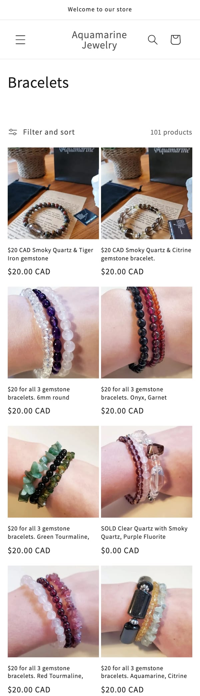
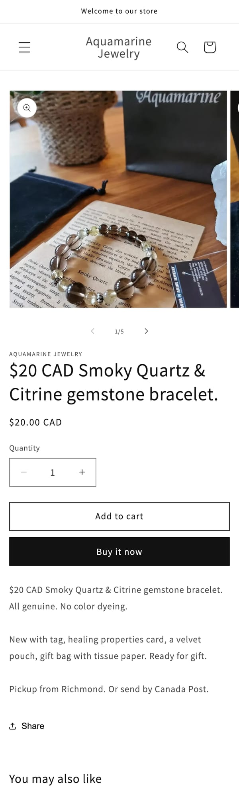
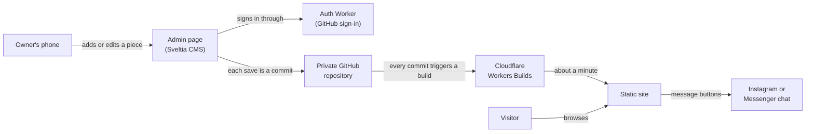
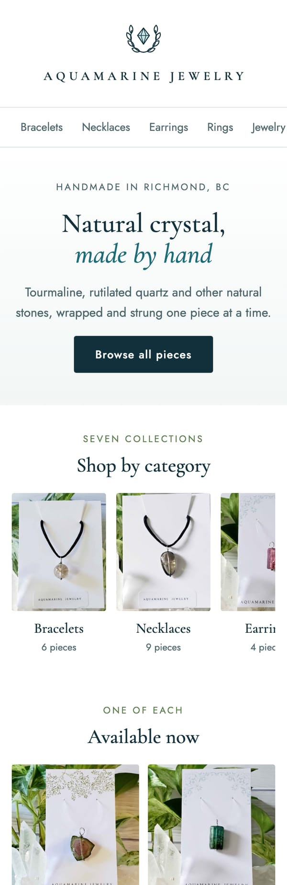
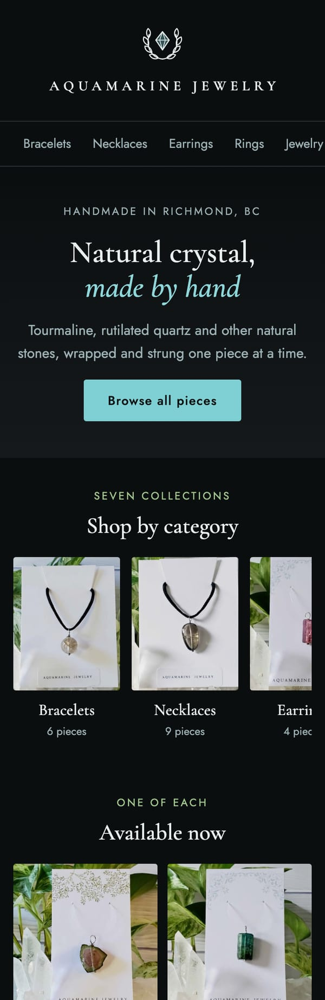
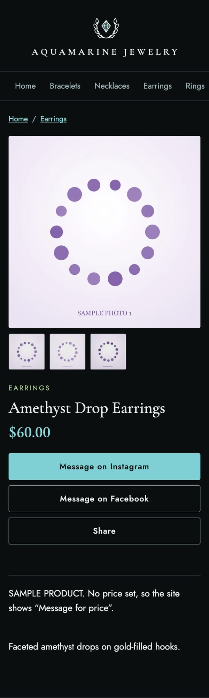
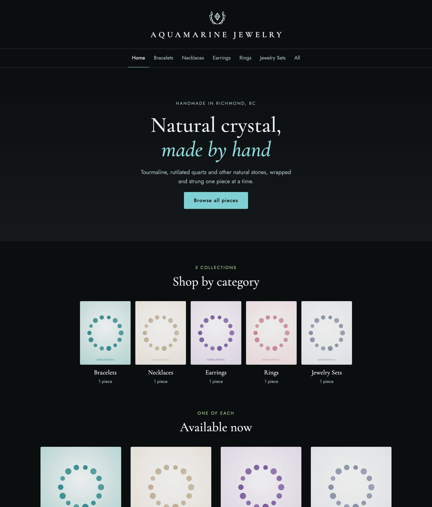

# The journey: from a Shopify store to a catalog

This page follows the project from the first build to the finished site. The short version: I built the wrong thing first, found out by talking to the owner, and rebuilt it around what the shop needs.

## 1. The first build: a Shopify store

The brief sounded like e-commerce: a jewelry shop that wants to sell online. So I set up a Shopify store.

- A development store running Dawn, Shopify's stock theme.
- **239 products** imported from the shop's Instagram post history through Shopify's Admin API, each with its photos.
- A standard category on every product, and five automatic collections built from those categories: Bracelets, Rings, Earrings, Necklaces and Jewelry Sets.
- Prices pulled from the original Instagram captions where a caption had one. That covered 79 products; **160 had no price**.

| Home | A collection | A product |
|---|---|---|
|  |  |  |

It worked as a store, and the screenshots show where it did not fit:

- **The titles are Instagram captions.** They start with a price ("$20 CAD Smoky Quartz & Citrine…") because that is how the piece was posted, not how a store names a product.
- **Sold pieces show as "$0.00 CAD".** The collection page lists pieces titled "SOLD…" with a zero price, because a store has no natural place for a one-of-a-kind piece that is gone.
- **The product page asks for a quantity** and offers "Add to cart" and "Buy it now", for a piece that exists once and is bought in a chat.

The 160 missing prices were the same signal in the data: the shop does not run like a store with a price list.

## 2. The conversation that changed the brief

Then I talked it through with the owner. Four things came out of that conversation.

| What I learned | What it means |
|---|---|
| Every piece is handmade and one of a kind. | There is no stock to count. A piece is available or it is sold. |
| Buyers already message the owner on Instagram or Facebook to buy. | A cart and a checkout would replace a process that works. |
| The shop posts on Facebook Marketplace, which limits the photos per listing and removes listings after a while. | The record of a piece disappears, including pieces that sold. |
| A monthly subscription is a real cost for a shop this size. | The running cost has to be close to zero. |

The owner did not want a store. The owner wanted **a permanent, good-looking record of each piece, with as many photos as it takes, that stays online after the piece sells**, and that can be updated from a phone.

Shopify does much more than that, charges for it every month, and its core features (cart, checkout, inventory, shipping) were the parts the shop would never use.

## 3. Rethinking it with AI

I took those requirements to Claude Code and worked through the options. The design we arrived at has four parts and no moving ones.

- **A static site.** Astro turns the content into plain HTML pages. Nothing runs when a visitor arrives, so there is nothing to keep alive and the free hosting tier is enough.
- **Content as files.** Each piece is a folder holding one text file and its photos. There is no database to host, back up or migrate.
- **An admin that commits.** Sveltia CMS is a page at `/admin/` that runs in the browser. Saving a piece writes a commit to the repository. Every change the owner makes is in the history and can be undone.
- **Three states for a piece.** Available, Sold and Hidden. A sold piece keeps its page, its photos and its description, with a Sold badge. That one rule is the reason the site exists.
- **No checkout.** Each piece has "Message on Instagram" and "Message on Facebook" buttons, and a Share button that opens the phone's share menu.

The first version was a proof of concept inside the Shopify theme's repository, built in an evening. Once it worked end to end (edit on a phone, commit, rebuild, live) I started a clean repository for it and left Shopify behind.

The proof of concept already had the features of the final site: categories, product pages, the Sold badge and the admin. It looked like a default template, which is what the next step fixed.

More detail: **[Shopify versus the catalog →](COMPARISON.md)**

## 4. Six designs and one choice

The owner's brief for the look was short: natural crystal, handmade; simple, classic, clean and modern; blue and green. As reference I gave Claude Code three screenshots of the shop's Marketplace listings.

Claude Code read those screenshots before designing anything. It noticed that every piece is photographed on a white card printed with the shop's name in spaced serif capitals, surrounded by green leaves and clear quartz. That shaped the designs: the photos already bring plenty of green, so the page around them stays quiet.

It then built six working prototypes in two rounds, each with a home page, a category page and a product page, using the shop's own photos.

The owner picked the first one, **Tidewater**, and then made a request I had not expected: dark mode only. The owner uses a phone in dark mode and wanted the site to match it, with no light version at all.

| Tidewater as first shown | Tidewater as chosen |
|---|---|
|  |  |

Going dark raised a design question. The shop's photos have white backgrounds, so on a near-black page they are the brightest thing on screen. Small photos in the grid are dimmed slightly so a page of them is comfortable to look at. The large photo on a product page is left alone, so the colour of the stone is true.

All six designs, with the reasoning behind each: **[Design options →](DESIGN-OPTIONS.md)**

## 5. The finished site

| Home | A product |
|---|---|
|  |  |

On a wider screen the same design opens up:

The chosen design went from prototype to the live site the same evening. The last steps were the ones that make it the owner's:

- **A logo.** A wreath of leaves around a cut stone, drawn in the same fine line as the shop's printed cards. The browser tab uses the stone alone, because the wreath blurs at that size.
- **Self-hosted fonts.** They are downloaded when the site is built and served from the site itself, so a visitor's phone never contacts a font service.
- **Home page text the owner controls.** The headline and the lines around it are fields in the admin.
- **The owner's category order.** The menu follows the order the owner arranges in the admin.
- **A phone check by measurement.** The home, category, list and product pages were loaded at 320, 360 and 390 pixels wide to confirm that nothing scrolls sideways and every tap target is tall enough for a thumb.
- **An owner's guide** in English and Chinese: signing in, adding a piece, photos, marking a piece sold, sharing a link.

The site in the screenshots shows sample pieces. The owner replaces them with real ones through the admin.

## What I took from it

- **Ask what the record is for before choosing the platform.** "Sell online" was my reading of the brief. "Keep a record of each piece" was the actual need.
- **The numbers were telling me early.** 160 of 239 products without a price is not a data problem. It is how the shop works.
- **A smaller design can be the better product.** The final architecture has fewer parts than a Shopify theme and does the one thing the shop needs.

---

The source code and the shop's content are kept in a private repository. The live site is linked from the [README](README.md).
