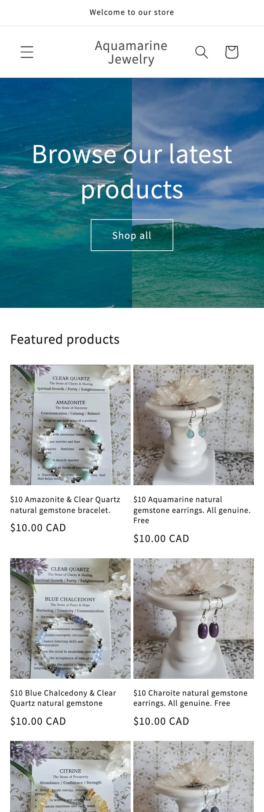
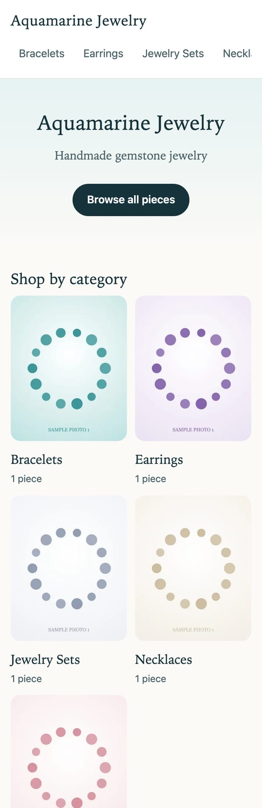
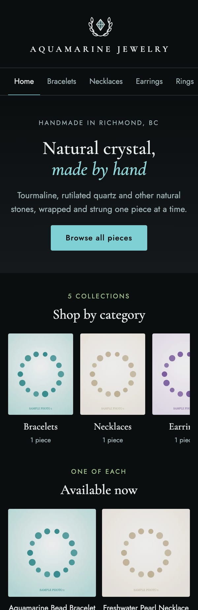
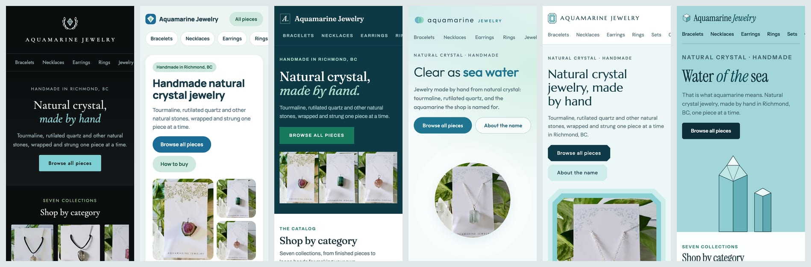
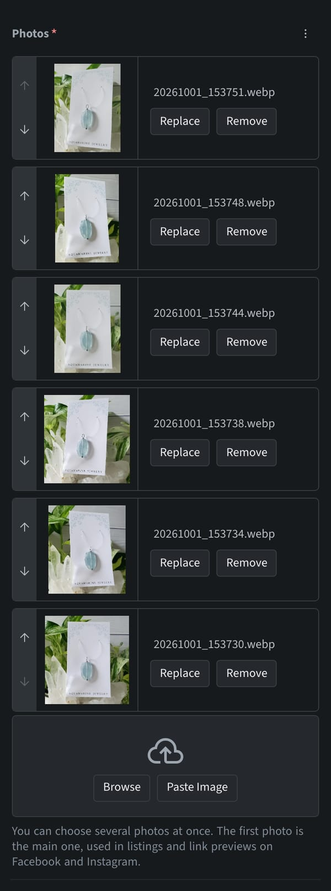
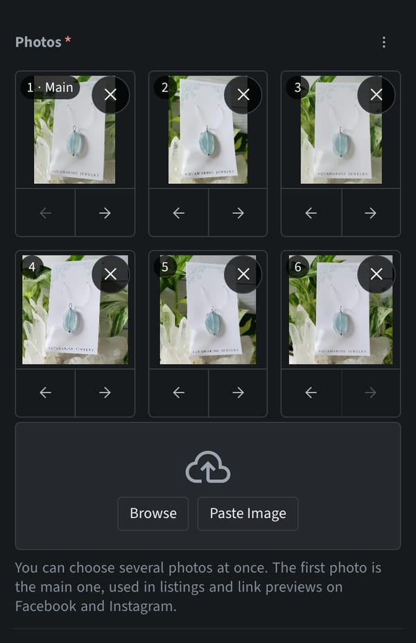

# Aquamarine Jewelry

A product catalog for a small shop that sells handmade, one-of-a-kind crystal jewelry. Visitors browse the pieces, then message the owner on Instagram or Facebook to buy. There is no checkout. The owner adds and edits pieces from a phone, and every piece keeps its page after it sells.

**See it live:** https://aquamarine-jewelry-store.gilbert-lee-tech.workers.dev (the owner has removed the sample pieces and is adding the real ones)

## From an idea to a product

This project did not end where it started. I first built the shop on Shopify. A conversation with the owner showed that Shopify answered a question nobody had asked, so I went back to what the shop needs and worked out a different design with an AI pair programmer.

| Shopify store | Proof of concept | Final site |
|---|---|---|
|  |  |  |

1. **A Shopify store.** A stock theme and 239 products imported from the shop's Instagram history.
2. **A conversation with the owner.** Every piece is made once and sold once. The shop needs a lasting record of its work, without a monthly bill.
3. **A new architecture, worked out with AI.** A static catalog, an admin that works from a phone, and free hosting. No database and no checkout.
4. **Six designs to choose from.** The owner picked one, then asked for it in dark mode only.
5. **Handover.** A logo, an owner's guide in English and Chinese, and a tagged first release.
6. **After launch.** Three changes the owner asked for, live within a day and a half.

**[Read the full journey →](JOURNEY.md)**

## Six designs, one choice

Claude Code built six working prototypes from a two-line brief and a few screenshots of the shop's listings. The owner chose the first one, Tidewater.

**[See all six designs and the logos →](DESIGN-OPTIONS.md)**

## Built with Claude Code

I did this with Claude Code, Anthropic's AI coding tool, as my pair programmer. I set the direction, made the decisions and approved each step; Claude Code did most of the hands-on work.

- About 31 hours from pulling the Shopify theme to the tagged first release of the catalog.
- 22 commits across the two private repositories: 15 co-authored with Claude, 6 made by the admin when a product was saved, and 1 by hand.
- Six design prototypes and six logos in one evening, with the chosen design live the same night.

**[See how I worked, and what went wrong along the way →](AI-WORKFLOW.md)**

## After launch: feedback to live in hours

| Before | After |
|---|---|
|  |  |

The owner started using the site and came back with requests: add several photos at once, tag each piece with its crystals, and make photos easier to put in order on a phone. All three were live a day and a half after the first release.

What made that possible is a small pipeline. A second copy of the site builds from a `dev` branch, with its own working admin. I try a change there on a phone, show the owner, and merge it through a pull request once the owner is happy. Every build is automatic and takes about a minute.

**[See the three changes and the pipeline →](AFTER-LAUNCH.md)**

## Shopify versus the catalog

**[Read the comparison →](COMPARISON.md)**

## Tech stack

Astro builds the site as plain HTML with resized images and self-hosted fonts. Sveltia CMS provides the admin: it runs in the browser and saves each change as a commit to a private GitHub repository. Cloudflare Workers hosts the site and rebuilds it on every commit, in about a minute. A second small Worker handles "Sign in with GitHub" for the admin. There is no database and no server to maintain.

**[See how the parts work together →](TECH-STACK.md)**

## About this repository

This is a showcase only. The source code and the shop's content are kept in a private repository. The product photos in the design screenshots are the owner's own and are shown with permission.
