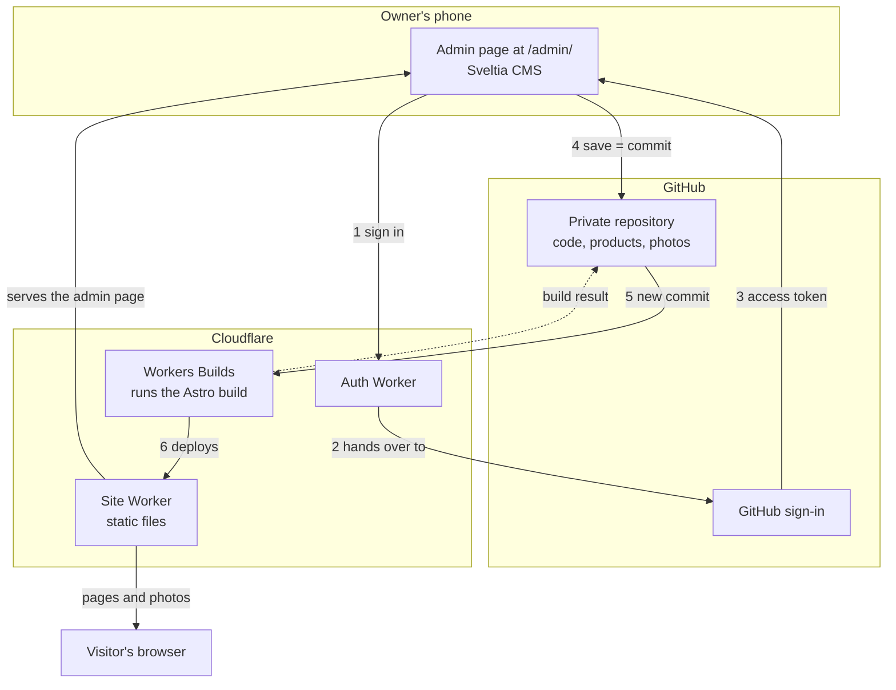
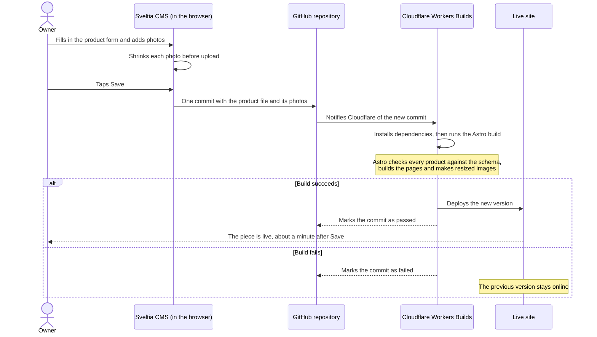
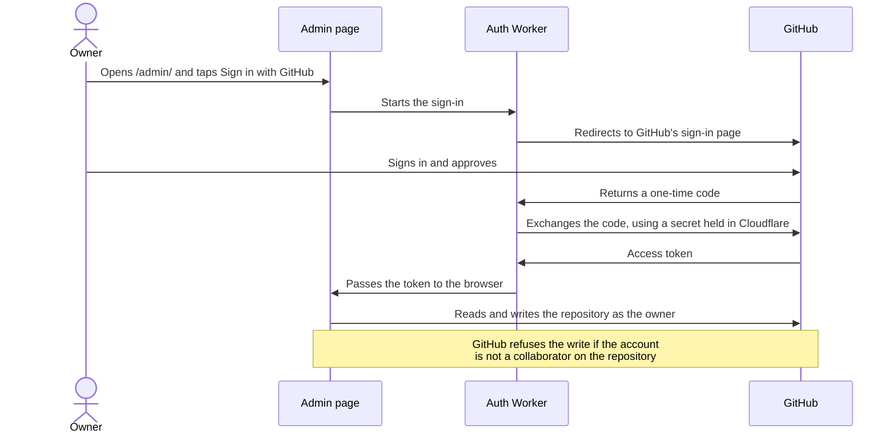

# Tech stack: how the site gets published

The catalog has no server and no database. Four tools pass the work along: the owner edits in **Sveltia CMS**, the change is stored in **GitHub**, **Cloudflare** builds and hosts it, and **Astro** is what the build runs. This page shows how they fit together and who is allowed to do what.

## The parts

| Part | What it is | Its job here |
|---|---|---|
| [Astro](https://astro.build) | A static site generator | Turns the content files into HTML pages, resized images and self-hosted fonts |
| [Sveltia CMS](https://sveltiacms.app) | A content editor that runs in the browser | The admin page at `/admin/`: a form for products and shop settings |
| GitHub | A private Git repository | Holds the code and every product, and decides who may edit |
| Cloudflare Workers | Hosting with a build service | Rebuilds the site on every commit and serves it |
| Auth Worker | A second, very small Cloudflare Worker | Handles "Sign in with GitHub" for the admin page |

## How they connect

The admin page is part of the site itself: one static HTML file that loads Sveltia CMS. Nothing about it is private except what it can do once someone has signed in.

## Publishing a change, step by step

This is what happens when the owner adds a piece.

Three details in that flow matter more than they look:

- **A save is a commit.** Sveltia CMS writes to the repository through GitHub's API from the browser. There is no backend of mine in between, so there is nothing of mine to keep running.
- **The build is the gatekeeper.** Astro validates every product against a schema: a product needs a name, a status must be one of three values, every photo needs a description. Bad content fails the build and never reaches visitors.
- **Photos are handled twice.** The admin shrinks a phone photo in the browser before committing it, so the repository stays small. The build then makes several smaller copies of each photo, and a visitor's phone downloads only the size it needs.

## Admin control: who can change the shop

Access is not managed by the site. It is managed by GitHub: **whoever can write to the repository can edit the shop, and nobody else can.**

| Who | Access | What they can do |
|---|---|---|
| Visitor | None | Browse the site and message the owner |
| Shop owner | Collaborator with write access | Add, edit, mark sold, hide or delete products; edit shop details and categories |
| Developer | Repository admin | Everything the owner can, plus the code, the design and who has access |

What that gives the shop:

- **No passwords of its own.** The site stores no accounts. Signing in is GitHub's job.
- **One switch to grant or remove access.** Adding or removing a collaborator on the repository is the whole procedure.
- **The secret stays off the site.** The sign-in needs a client secret, which lives only in the Auth Worker's settings in Cloudflare. It is not in the repository and never reaches the browser.
- **The Auth Worker answers one site only.** It is configured with the shop's own address and refuses sign-in requests that come from anywhere else.
- **Every change has an author and a date.** Each save is a commit under the name of whoever made it, so a mistake can be found and undone.
- **The admin page is hidden from search engines**, and finding it gains a stranger nothing without write access to the repository.

## What Astro builds

- **Pages:** the home page, one page per category, a list of all pieces with a search box, and one page per piece.
- **Only what should be seen:** a piece marked Hidden is not built at all. A piece marked Sold is built, with a Sold badge.
- **Link previews:** each product page carries the tags that Facebook, Messenger and Instagram read to show a photo, a name and a price when a link is shared.
- **Images:** resized WebP copies at several widths.
- **Fonts:** downloaded during the build and served from the site, so visitors never contact a font service.
- **A sitemap** for search engines.

The result is a folder of plain files. Cloudflare serves that folder; no code runs when a visitor opens a page.

## What it costs to run

The site uses the free tiers of GitHub and Cloudflare, and both tools are open source. There is no subscription to keep the shop online.

## Limits worth knowing

- **Every save rebuilds the whole site.** That takes about a minute today and will take longer as the catalog grows.
- **Each editor needs a GitHub account.** That is one extra step for a shop owner who has never used GitHub.
- **The admin loads Sveltia CMS from a public CDN.** If that CDN is unreachable, the admin does not open, though the shop itself is unaffected.
- **There is no checkout.** That is a decision, not a gap: see [Shopify versus the catalog](COMPARISON.md).

---

The source code and the shop's content are kept in a private repository. Back to the [README](README.md).
